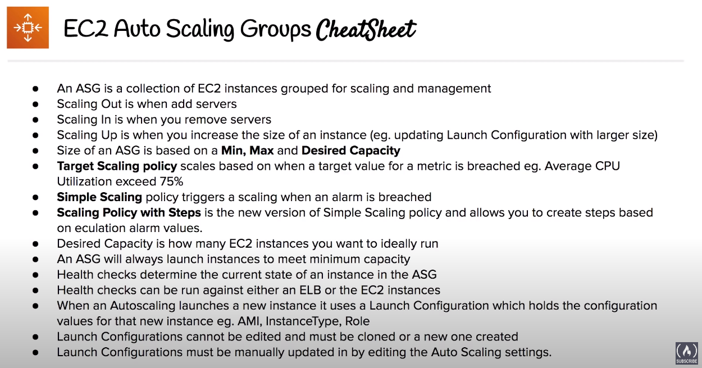

# ASG

Auto Scaling Groups

## Overview
- Set scaling rules which will automatically scale in and scale out EC2 instances to meet current demand
- EC2 instances in a ASG is consider as a group for purposesof automatic scaling and management

## Automatic scaling

### Capacity settings
- Maximum, minimum and desired capacity
- ASG will always launch instances to meet minimum capacity

### Health check replacements

#### EC2 Health Check
- Based on EC2 Status Checks. If an instance is considered unhealthy, ASG will terminate and launch a new instance

#### ELB Health Check
- Pinging HTTP(S) endpoint with an expected response. If ELB determines a instance is unhealthy, it forwards this information to ASG which will terminate and launch a new instance

### Scaling policies
- Scaling Out: add instances. Scaling In: remove instances
- Target Tracking Scaling Policy: maintains a specific metric (e.g. CPU Utilization) at a target value
- Simple Scaling Policy (legacy, use scaling policies with steps): scales when an alarma is breached
- Scaling policies with steps: scales when an alarm is breached, can scalates based on alarm value changing. Replaces simple scaling policy functionality

## ELB Association
- ASG can be associated with Elastic Load Balancers (ELB), allowing to set richer health checks
- Classic Load Balancers are associated directly to the ASG
- ALBs and NLBs are associated indirectly, via Target Group, to the ASGs

## Launch Configurations
- Instance configuration template that ASG uses to launch EC2 instances
- Launch Configurations cannot be edited, you need to create a new one and manually associate that new Launch Configuration to the ASG
- Launch Templates are Launch Configurations with Versioning

