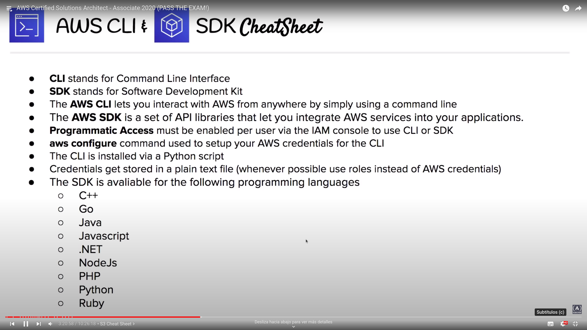

# Programmatic access

## CLI

AWS Command Line Interface

### Overview
- Control multiple AWS services from command line and automate them through scripts
- [Installation documentation]https://docs.aws.amazon.com/cli/latest/userguide/getting-started-install.html)
- Important flags:
	- `--profile`: switch between AWS accounts (requires to configure `~/.aws/credentials` file with profiles)
	- `--output`: change command output between json, text or table

## SDK

AWS Software Development Kit

### Overview
- Control multiple AWS servics using populer programing languages
- Set of tools and libraries that you can use to create apps for a specific software package, letting you to integrate AWS services with your apps
	- Python (boto3)
	- Go
	- Javascript
	- Ruby

## Access keys and Secret
- Available to be created when Programmatic Access for a AWS user is enabled
- Access Key ID and Secret Access Key
- Stored locally on user home on plain text file (eg. `~/.aws/credentials`)

## Cloud9
- Cloud-based integrated development environment (IDE), accessible through the browser
- Includes a cloud editor, debugger and a terminal
- Prepare with essential tools for most of the popular programming languages (Python, JavaScript)

