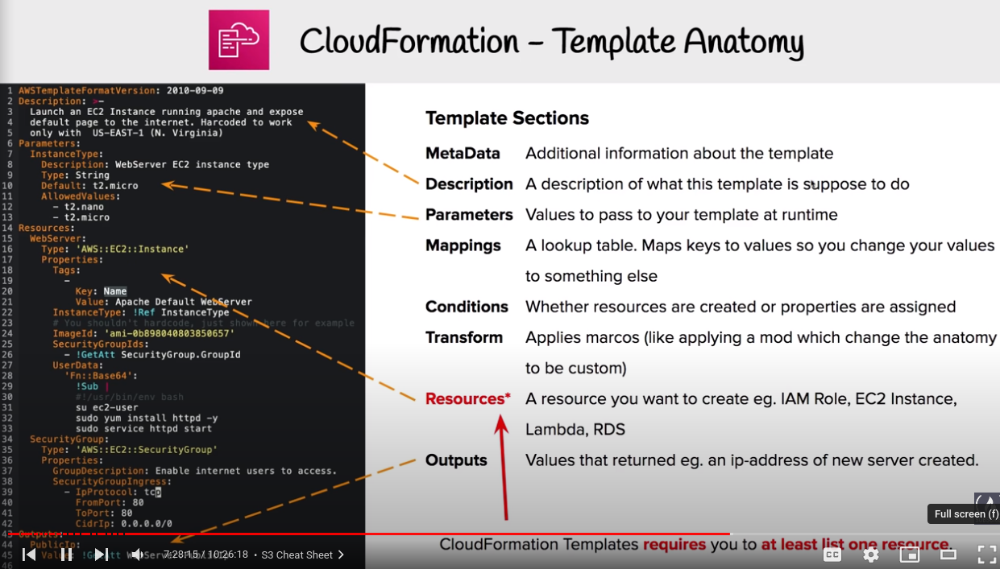
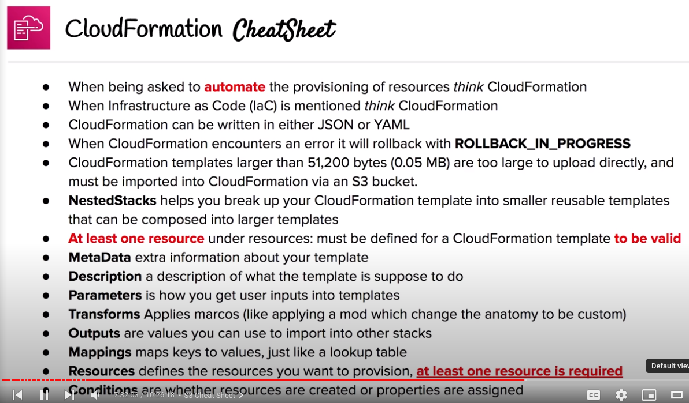

# CloudFormation

## Infrastructure as Code (IaC)

- Managing and provisioning infrastructure through machine-readable definition files (YAML, JSON, XML) rather than physical hardware configuration or interactive configuration tools, avoiding manual configuration

## Overview

- Template Language that defines AWS Resources to be provisioned
- Automating the creation of resources via code

## Template formats
- 2 formats
	+ JSON
	+ YAML (preferred one)
	
## Template sections

- CloudFormation Templates requires you to define one resource at least
 
## AWS Quick Starts

- Collection of pre-built CloudFormation templates

