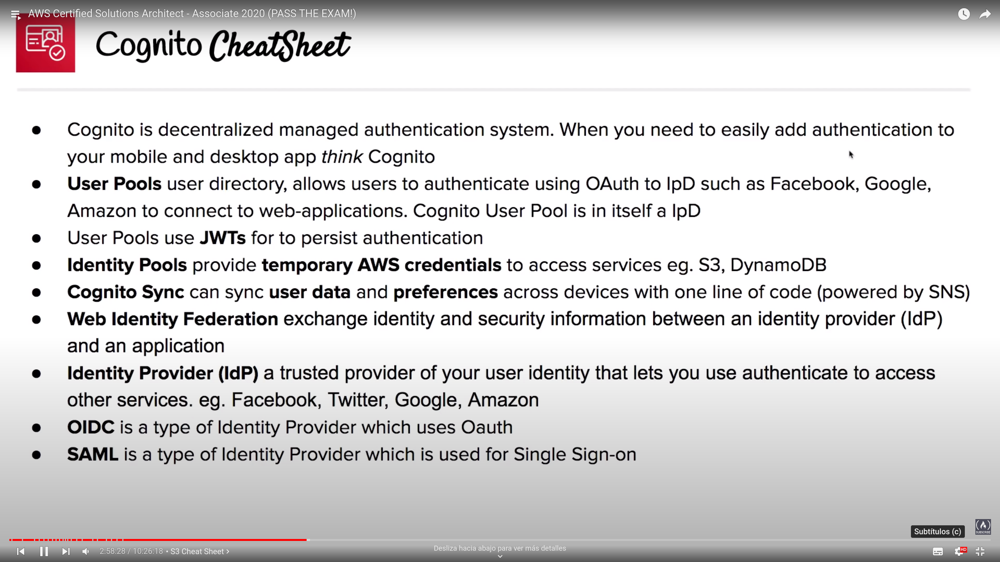

# Cognito

## Overview
- Dencentralized Managed Authentication
- Sign-up, sign-in integration for your applications
- Identity broker between AWS and identity provider, generating a JSON Wbe Token after successfull user authentication

## Web identity federation
- To exchange identity and security information between an identity provider and an application

## Identity Provider
- Trusted provider of your user identity that lets you use authenticate to access other services
- Types:
	- SSO (Single Sign On) -> SAML (Security Assertion Markup Language)
	- OAuth -> OIDC (OpenID Connect)

## User Pools
- User directories used to manage the actions for web and mobile apps
- Use JSON Web Token to persist authentication
	- Sign-up
	- Sign-in
	- Account recovery
	- Account verification
- Decentralize your authentication

### Attributes
- Password requirements
- Apply MFA
- Restrict users access (on their own, admin verification)
- Trigger custom logs via Lambdasafter actions

## Identity Pools
- Temporary credentials to access AWS services
- Actual mechanism authorizing access to the AWS resources
- Authentication providers (Cognito - Amazon - Facebook)
- Unauthenticated identities: provide a unique identifier and AWS credentials to enable access

## Cognito Sync
- Sync user data and preferences across devices
- Push synchronization to push updates and synchronize data
- Uses SNS to send notifications to all user devices when data in the cloud changes

