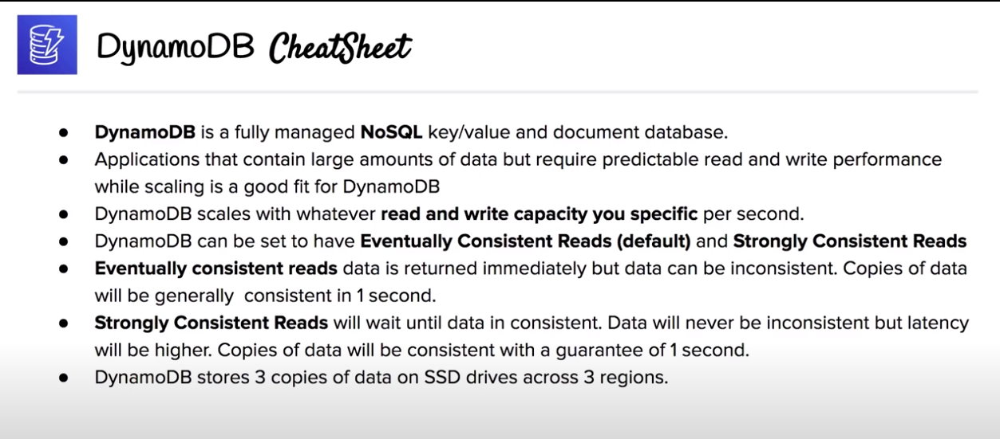

# DynamoDB

## Core concepts

- No-SQL: database which is neither relational and does not use SQL to query the data for results
- Key-value store: form of data storage which has a key which references a value
- Document store: form of data storage which a nested data structure (JSON, YML, XML...)

## Overview

- Key-value and document database (No-SQL)
- Guarantees consistent reads and writes at any scale
- Specifies your read and write capacity per second, it just works at whatever capacity you need without you tweaking anything
- All data is stored on SSD storage, spread across 3 different regions
- Features:
	+ Fully managed
	+ Multiregion
	+ Durability
	+ Backup and restore
	+ In-memory caching
	+ Built-in security
	
## Table structure

- Item: row of a table
- Atribute: column value
- Primary key:
	+ Partition key: DynamoDB uses the partition key value as input to an internal hash function. The output from the hash function determines the partition (physical storage internal to DynamoDB) in which the item will be stored.
	+ Sort key (optional): All items with the same partition key value are stored together, in sorted order by sort key value
	
## Consistency

- 2 types of mechanism to configure consistent reads
	+ Eventual (default):
		* Reads are fast but consistent is not guaranteed
		* All copies of data eventually become generally consistent within a second
	+ Strongly:
		* It will not return a result until all copies are consistent
		* You have a guarantee of consistency but latency is higher (slower reads)
		* All copies of data will be consistent within a second

