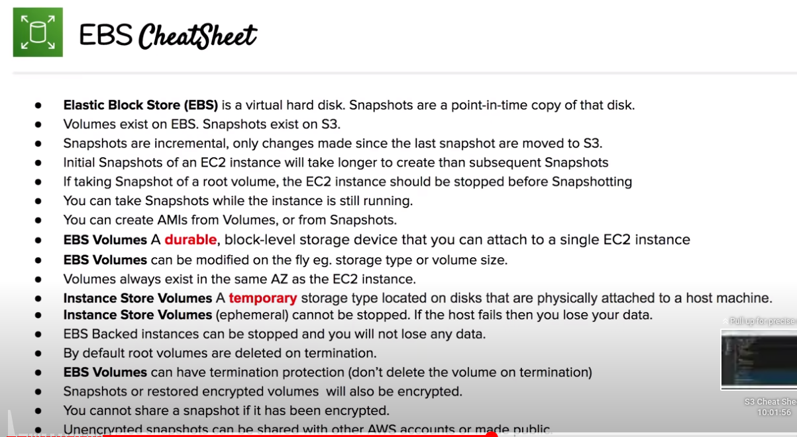

# EBS

Elastic Block Storage

## Core concepts

- IOPS: Input/Output per Second.  it is the speed at which non-contiguous reads and writes can be performed on a storage medium
- Throughput: data transfer rate to and from the storage
- Bandwidth: measurement of the total possible speed of data movement along the network
- Hard Disk Storage (HDD): Magnetic storage that uses rotating platters, an actuator arm and a magnetic head (physical components, limiting IOPS). It is good at writing a continuously amount of data (good throughput).
- Solid State Drive (SSD): Integrated circuits, assembled as memory, to store data persistenly, typically using flash memory. They are more resistant, quieter and faster than HDD (not physical moving parts). They are good for frequently reads and writes (IOPS)
- Magnetic Tape: Durable for decades and cheap to produce

## Overview

- Virtual hard drive in the cloud
- Volumes for EC2 instances, backable via snapshts and supports encryption
- Highly available and durable solution for attaching persisten vlock storage volumes to an EC2 instances
- Volumes are automatically replicated within their AZ to protect from component failure
- 5 types of storage:
    + General purpose (SSD): gp2 -> used for most workloads
    + Provisioned IOPS (SSD): io1 -> IOPS greater than 16000 or throughput greater than 250MiB (large databases)
    + Throughput Optimized HDD: st1 -> Big Data, Log Processing, Data Warehouses
    + Cold HDD: sc1 -> File Storage
    + EBS Magnetic (standard, previous HDD generation) -> Archival storage

## Moving volumes

- From one AZ to another
    + Take a snapshot of the volume
    + Create an AMI from the snapshot
    + Launch new EC2 instance in desired AZ
- From one Region to another
    + Take a snapshot of the volume
    + Create an AMI from the snapshot
    + Copy the AMI to the desired region
    + Launch new EC2 instance from the copied AMI

## Encrypted Root Volume

- You can encrypt the volume on creation
- If you want to encrypt an existing volume:
    + Take a snapshot of the unencrypted volume
    + Copy the snapshot and select encryption option
    + Create an AMI from the encrypted snapshot
    + Launch EC2 instance from the created AMI

## Instance Store Volume

- Ephemeral storage located on disks that are phtsically attached to a host machine
- Created from a template stored in S3
- Data will be loss in case of health host fails or instance is terminated
- Ideal for temporary backups, caches, logs...

