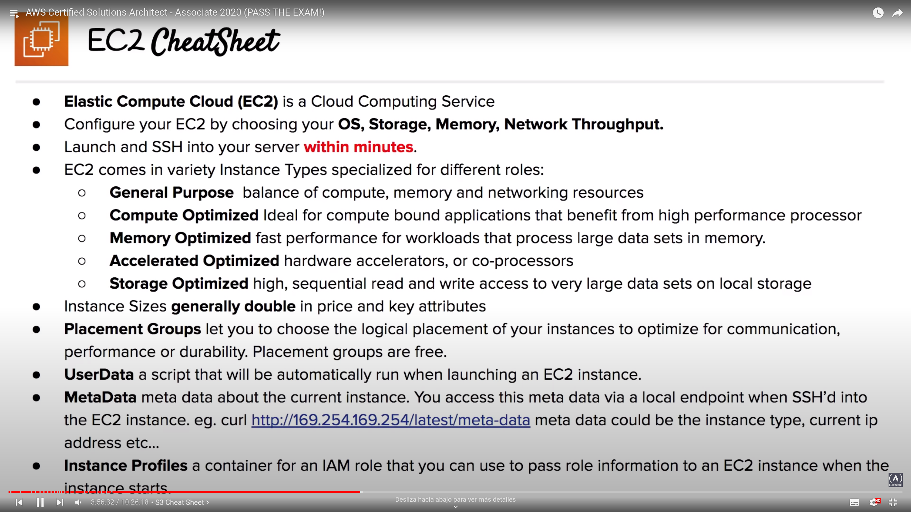
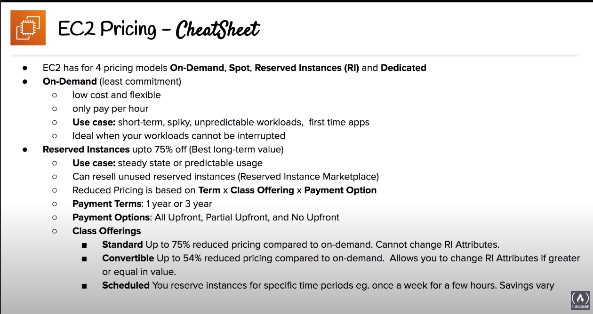
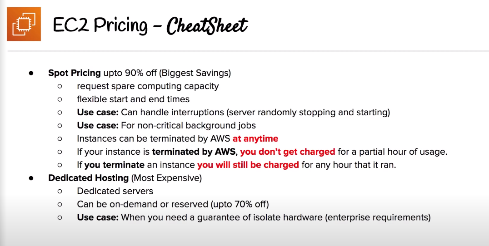
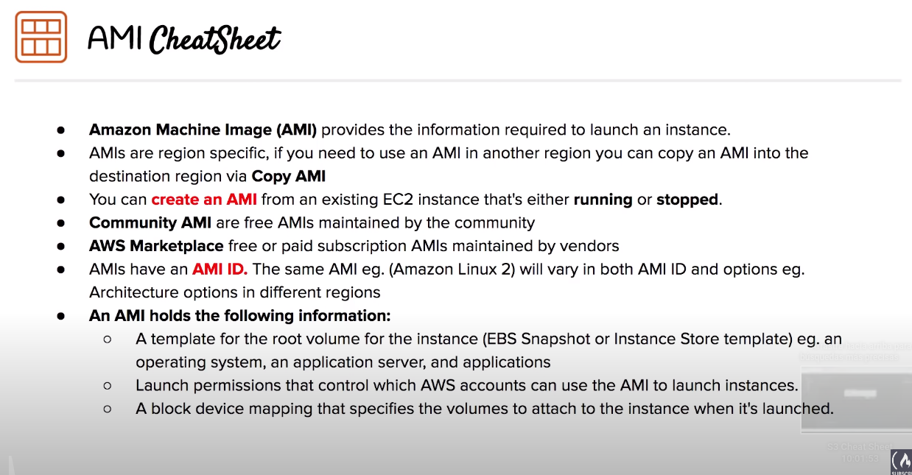

# EC2

Elastic Compute Cloud

## Overview
- Highly configurable server
- Flexible, it is resizable compute capacity
- **Anything and everything on AWS uses EC2 Instances underneath**

## Instances Types
- General purpose: T3, M5; balance of compute, memory and networking resources
- Compute Optimized: C5, C5n; high performance processor
- Memory Optimized: R5, R5a, X1; fast performance for workloads that process large data sets in memory
- Accelerated Optimized: P3, G3, F1; hardware accelerators, co-processors
- Storage Optimized: I3, D2, H1; high, sequential read and write access to very large data sets in local storage

## Instances sizes
- Sizes generally doble in price and key attributes
- To upgrade or downgrade just up or down to the next size, respectively

## Instace Profiles
- Attach a role to an Instance to give it acces to AWS Resources without embedding AWS credentials directly (not recommendend, avoid this practice)
- Reference to a IAM role
- **Always avoid embedding your AWS credentials when possible**

## Placement Groups
- Choose logical placement of your instance to optimize communication, performance or durability.
- Free, optional use
- 3 different types:
	- Cluster: same AZ (cannot be multi-AZ), low-latency network, well suited for HPC apps. Same rack for all instances
	- Partition: spreads instances across logical partitions, rack per partition (each partition do not share hardware), wel suited for large distributed and replicated workloads (Hadoop, Kafka, Cassandra)
	- Spread: each instance is placed on a different rack, well suited for critical instances that should be keep separated. Spreads can be multi-AZ, maximum of 7 instances. 1 rack per instance 

## Userdata
- Script that wille be automatically run when launching an EC2 instance
- `curl http://169.254.169.254/latest/user-data` to see the userdata script

## Metadata
- Useful to perform all sorts of advanced AWS staging automation when you combine with user data
- `curl http://169.254.169.254/latest/meta-data` to see the metadata information

## EC2 pricing
4 categories

### On-Demand (default)
- Oriented to short-term, spikey or unpredictable workloads (experiment, development)
- No up-front payment and no long-term commitment
- Charged by hour (default) or by minute

### Reserved (RI)
- Designed for steady-state, predictable usage or require reserved capacity
- Can be shared between multiple accounts
- Can be sold in the RI Marketplace
- Reduced Pricing is based on Term, Class Offering and Payment Option
- Class Offering:
	- Standard: cheapest, but you can change RI attributes
	- Convertible: the most expensive, but allows you to change RI Attributes if greater or equal in value
	- Scheduled: reserve instances for specific time periods (e.g once a week for a few hours). Savings vary
- Terms:
	- Commit to a 1 Year or 3 Year contract
	- The longer the term the greater savings

- Payment options:
	- All upfront, Partial upfront, No upfront
	- The greater the upfront the greater the savings

### Spot
- Biggest savings option
- Instances can be terminated by AWS at any time, if the computing capacity is required by on-demand customers
- You do not charged for a partial hour of usage if this happens
- If you terminate an instance you will still be charged for any hour that it rans
- AWS Batch is an easy and convenient way to use Spot Pricing
- Designed for applications that have flexible start and end times or applications that are only feasible at very low compute costs

### Dedicated
- Most expensive option
- Designed to meet regulatory requirements (server-bound licensing that won't support multi-tenancy or cloud deployments) or enterprise requirements
- Multi-tenant vs. Single-Tenant:
	- Multi-Tenant: virtual isolation between customers
	- Single-Tenant: physical isolation between customers
- Offered in both On-Demand and Reserved instances

## AMIs
- Templates to configure new instances
- Create copies of your servers by turning your EC2 instances into AMIs
- Region specific (AMI ID varies between regions for the same AMI)
- AMIs hold the following information:
	- Template for the root volume for the instance (OS, apps...)
	- Block devide mapping that specifies the volumes to attach to the instance when it is launched
	- Launch permission that control which AWS accounts can use the AMI to launch instances

### Use case
- System Manager Automation to routinely patch AMIs with security updates
- AMIs are used with Launch Templates
- Help to keep incremental changes to your OS, app code and system packages

### AMI Marketplace
- Let you purchase subscriptions to vendor maintained AMIs
	- e.g Security harden AMIs are very popular

### AMI Creation
- Create an AMI from a running or stopped EC2 instance

### Choosing an AMI
- Community AMI are free, AMIs on AWS Marketplace could be free or paid
- AMIs have an AMI ID which is region specific
- Can be selected based on:
	- Region
	- OS
	- Architecture
	- Launch Permissions
	- Root Device Volume
		- EBS
		- Ephemeral instance store

### Copying an AMI
- Region specific, useful to use an AMI from another region
- Copy the AMI and select the destination region

