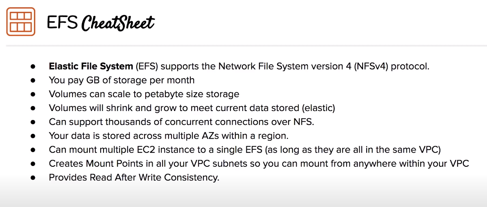

# EFS

Elastic File System

## Overview
- Scalable, elastic cloud-native NFS file system
- File storage service for EC2 instances. A single FS volume can be attached to multiple EC2 instances in the same VPC
- AWS manages disk space, storage capacity grows, up to petabytes, and shrinks automatically based on data stored (elastic)
- EC2 instances install NFSv4.1 and can then mount the EFS volume. EFS use NFS version 4 protocol
- EFS creates multiple mount targets in all your VPC subnets
- Pay GB of storager per month (eu-west-1)
- Lifecycle policies to manage frequent and infrequent accesed files, similar to S3
- It supports encryption
- Add NFS port (2049 by default) to your EC2 instances security group in order to mount the volume
- Provides Read After Write Consistency

