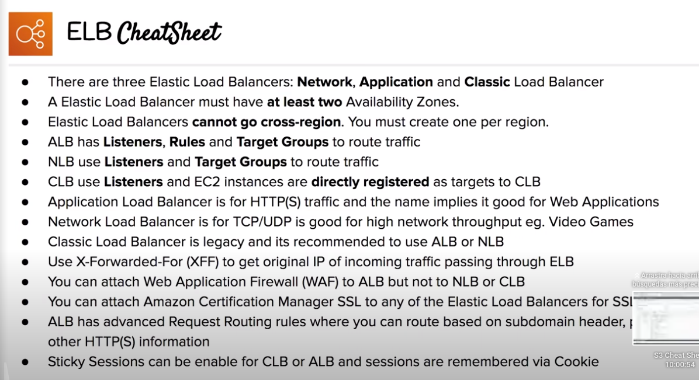

# ELB

Elastic Load Balancer

## Overview
- Distributes incoming application traffic across multiple targets, such as EC2 instances, containers, IP addresses and Lambda fucntions
- Must have at least two AZs and cannot go cross-region (must create one per region)
- Physical hardware or virtual software thah accepts incoming traffic, and then distributes the traffic to multiple targets
- You can attach ACM SSL to any of the ELB types for SSL support
- Balances the traffic load via different rules, based on the types of load balancers:
	- Application Load Balancer (ALB) -> layer 7 (HTTP/HTTPS)
	- Network Load Balancer (NLB) -> layer 4 (TCP/UDP)
	- Classic Load Balancer (CLB, Legacy)

## Components

### Listeners
- Evaluates any traffic that it matches the Listener's port
- For CLB, EC2 instances are directly registered to the LB, using just listeners

### Rules
- Not available for CLB
- Listeners invoke rule to decide what to do with the traffic
- Generally, rules forward traffic to a Target Group

### Target Group
- Not available for CLB
- EC2 instances are registered as targets to a Target Group

## Application Load Balancer (ALB)
- Designed to balance HTTP and HTTPS traffic (web applications)
- Has listeners, rules and target groups to route traffic
- Operate at Layer 7 (application layer on TCP/IP stack)
- Request Routing: allows you to add routing rules to your listeners based on HTTP(S) protocol
- Web Application Firewall (WAF) can be attached to ALB

## Network Load Balancer (NLB)
- Designed to balancer TCP/UDP
- Operate at Layer 4 (trasport layer on TCP/IP stack)
- Uses listeners and target groups to route traffic
- Can handle millions of requests per second while still maintaining extremely low latency
- Can perform Cross-Zone Load Balancing
- Great when network performance is critical

## Classic Load Balancer (CLB, legacy)
- It was AWS first load balancer
- It only uses Listeners and EC2 instances are directly registered as targets to CLB
- It can balance HTTP or HTTPS, using layer 7 specific features such as sticky sessions
- It also can balance TCP traffic using strict layer 4
- Can perform Cross-Zone Load Balancing
- It will respond with a 504 error (timeout) if the underlying app is not responding (at the web server or database level)
- Not recommended for use right now

### Sticky session
- Advanced load balancing method that allows you to bind a user session to a specific EC2 instance
- Ensures all request form that session are sent to the same instance
- Typically used with CLB, but ALB can handled too (can only be set on a Target Group). Not available for NLB
- Cookies are used to remember which EC2 instance
- Useful when specific information is only stored locally on a single instance

## XFF Header
- X-Forwarded-For header
- Command method for identifying the originating IP address of a client connecting to a web server through an HTTP proxy or a load balancer

## ELB Health Checks
- Report health checks as `InService` or `OutofService`
- Communicate directly with the instance to determine its state
- Done not terminate unhealthy instance (ASG function), it will just redirect traffic to healthy instances

## Cross-Zone Load Balancing
- Only for CLB and NLB
- When enabled, requests are distributed evenly across the instances in all enabled AZ
- When disabled, requests are distributed evenly across the instances in only its AZ

## Request routing
- Apply rules to incoming traffic an the forward or redirect traffic
- We can check on different conditions:
	- Host header
	- Http header
	- Source IP
	- Path
	- Query string
	- HTTP header method

