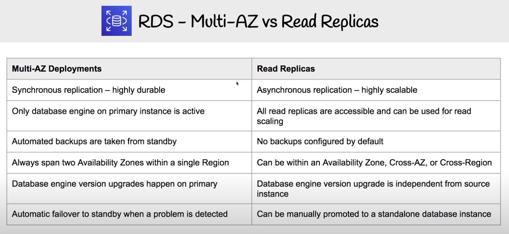
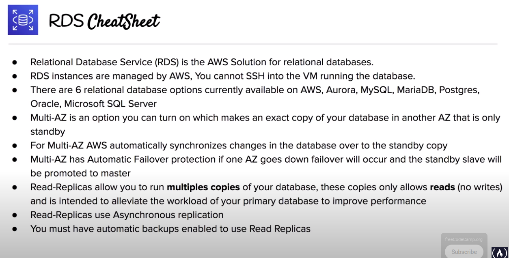
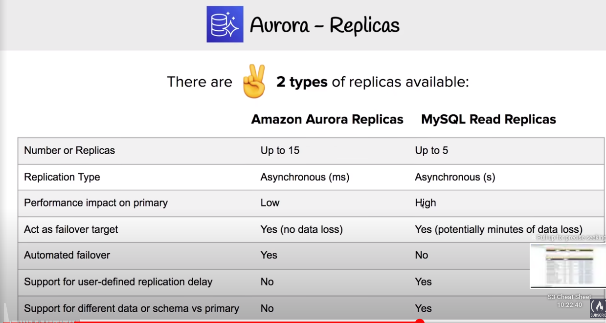
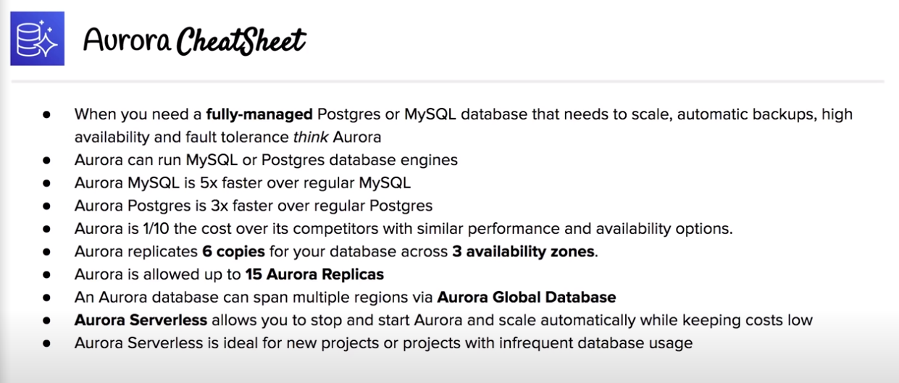

# RDS

Relational Database Service

## Overview

- A managed relational database services that supports multiple SQL engines (MySQL, MariaDB, Amazon Aurora, PostgreSQL, Oracle, SQL Server)
- Easy to scale, backup and secure

## Encryption

- Encryption at-rest for all RDS engines (newer engine versions)
- It will also encrypted the automated backups, snapshots and read replicas
- Handled by AWS KMS

## RDS Backups

- Automated backups:
    + 1-35 days retention period (7 days by default)
    + Enabled by default
    + Data is stored inside S3
    + No additional charges
    + Backup window -> Storage I/O may be suspended during backup
- Manual snapshots:
    + Taken manually by the user
    + Persists after RDS instance deletion

- Restore to point in time, created a new instace (new DNS endpoint) using the most recent daily backup (apply transaction log data relevant to that day)

## Multi-AZ

- Ensures database remains available if another AZ becoms unavailable
- An exact copy of yout database will be created in another AZ. AWS will keep them synchronized (master-slave pattern, synchronous replication)
- Automatica Failover protection if one AZ goes down failover standby slave will be promoted to master

## Read Replicas

- Multiple copies of your database that only allow reads
- Intended to reduce workload of your primary database (allows writes too) and improve performance
- You must have automatic backups enabled to use read replicas
- Asynchronous replication happens between the primary RDS instance and the replicas

## Aurora

- Fully managed Postgres or MySQL compatible database
- Designed by default to scale and fine-tuned to be really fast
- Combines the speed and availability of high-end databases + simplicity and cost-effectiveness of open source databases

## Scaling and availability with Aurora
- Storage autoscales in 10Gb increments, up to 64Tb
- Computing resources can scale all the way up to 32 vCPUs and 244GB of memory
- A minimun of 3 AZs with 2 copies of your data for each AZ
    + Lose up to 2 copies without affecting writeness
    + Lose up to 3 copies without affecting readiness

## Aurora Fault tolerance & durability

- Handled automatically by AWS
- Snapshot can be shared between AWS accounts
- Storage is self-healing: contiunously scanned for errors and repaired automatically

## Aurora Replicas

## Aurora Serverless

- Will automatically start up, shut down and scale capacity up and down based on your application's needs
- Pay for database storage and the database capacity and I/O consumes while it is active
- Ideal for new projects or projects with infrequent database usage

