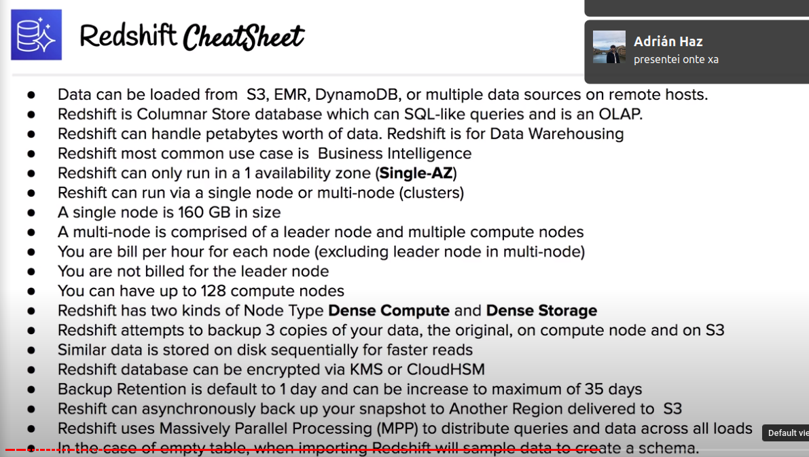

# Redshift

## Core Concepts

- Database transiction: simbol of a unit of work performed within in a database management system (reads and writes)
- Database vs. Data Warehouse:
	+ Online Transaction Processing (OLTP) vs. Online Analytical Processing (OLAP)
	+ Fast access to specific transcations vs. Fast, complex querie accross all, large amount of data
	+ Single source vs. multiple sources
	+ Short transactions (emphasis on writes) vs. long transactions (emphasis on reads)
	
## Overview

- Fully managed Petabyte-size Data Warehouse
- Analyze (Run complex SQL queries) on massive amounts of data -> Used for Business Intelligence (BI)
- Columnar store database: store data together as columns instead of rows, reduces drastically the overall disk I/O requirements and reduces the amount of data ou need to load from disk
- Redshift price is less than 1/10 cost of most similar services
- Use case: centralize data from different data sources to power a custom BI tool

## Configuration

- Single Node: 1 node of 160GB
- Multi node: cluster of nodes with 2 types of nodes
	+ Leader node: manages connections and receives queries
	+ Compute node: stores data and performs queries. Max limit of 128 (32 by default, ask for AWS Redshift limit increase)

### Node types and sizes

- Dense Compute (dc2, dc1): higher performance, less storage
- Dense Storage (ds2): more storage, lower performance

## Compression

- Uses multiple compression techniques to achieve significant compression relative to traditional relational data stores
- Similar data is stored sequentially on disk
- Indexes or materalized views are not required, which saves a lot of space

## Processing

- Uses Massively Parallel Processing (MPP)
- Automatically distributes data and query loads acrros all nodes
- Lets you scale up and down your data warehouse while still maintaining fast query performance

## Backups

- Enabled by default with a 1 day retention period, you can increase it up to 35 days
- Redshift always attempts to maintain at least 3 copies of your data
	+ The original one
	+ Backup copy in S3
	+ Replica on the compute nodes

## Billing

- Charged by compute node hours (not charged for leader node hours)
- S3 storage fees due to backups are stored on S3
- Billed for data transfer within VPC, not outside of it

## Security

- Data in transit is encrypted using SSL
- Data at rest is encrypted using AES-256 encryption
- It can be applied using KMS our HSM

## Availability

- Redshift is Single-AZ
- To run Multi-AZ you would have to run multiple Redshift Clusters in different AZs with same inputs
- Snapshots can be restored to a different AZ

