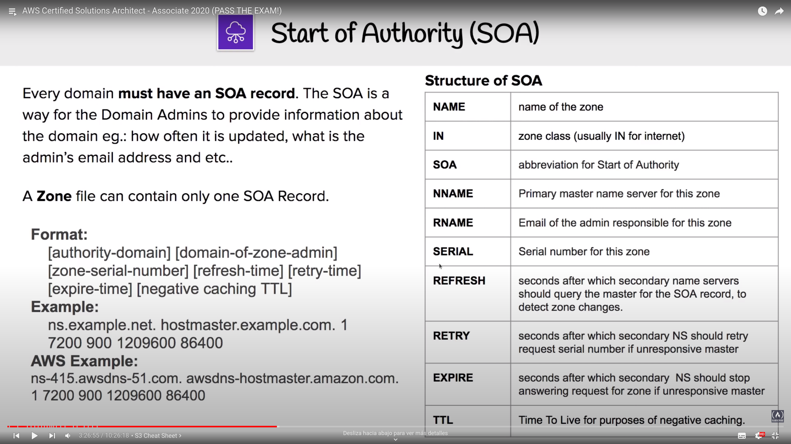
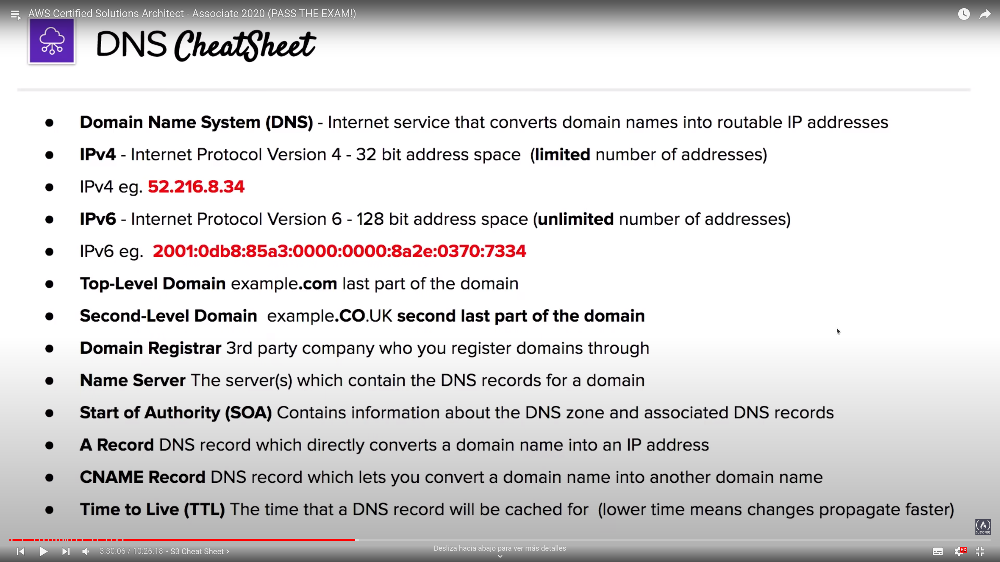

# Route53

## Introduction to IP
- Internet Protocol
- IP Addresses: computer identifier on a network, allows communication with it using the Internet Protocol
- Two versions:
	- IPv4: 32-bit address space
	- IPv6: 128-bit address space

## Introduction to DNS
- Domain Name Service
- Translates domain names to IP addresses
- Find specific servers on the Internet depending what domain name you browse

### Domain registrers
- Authorities who have the ability to assign domain names under on or more [top-level domains](#top-level-domains)
- Domain get registered through InterNIC, service provided by the Internet Corporation for Assigned Names and Numbers (ICANN), enforcing the uniqueness of domain names all over the internet.

### Top-level domains
- Last word within a domain represents the **top-level** domain name
- The second word within a domain name is know as the **second-level** domain name
- Controlled by the Internet Assigned Numbers Authority (IANA)
- AWS has their own top level domain: **.aws**

### Start of Authority (SOA)
- SOA record stores information about the domain
- A Zone file can contain only one SOA Record

### Address (A) Records
- Allows you to convert the name of a domain directly into an IP Address

### Canonical Names (CNAME) Records
- Used to resolve one domain name to another rather than an IP address
- Useful when you work with dynamic IPs

### Name Server (NS) Records
- Used by top-level domain servers to direct traffic to the DNS server containing the authoritative DNS records.
- Multiple name servers can be provided for redundancy
- In AWS NS records would be pointed at the AWS servers

### Time to Live (TTL)
- Lenght of time that a DNS record gets cached on the resolving server
- The lower the TTL, the faster that changes to DNS records will propagate across the Internet
- Measured in seconds under IPv4

## Introduction to Route53
- Highly available and scalable cloud DNS, integrated with AWS Services
- Functionalities:
	- Register and manage domains
	- Create DNS routing rules
	- Implement complex traffic flows
	- Resolve VPCs outside AWS
	- Monitoring DNS records
- Use case: get custom domain to point to your AWS Resources

### Record Sets
- Create record sets to point naked domain and subdomains via domain records

#### Alias Record
- AWS own special record to extend DNS functionality, allowing to detect IP changes and continuously pointing that endpoint to the correct resource
- Useful whe routing traffic to AWS resources

### Routing policies
- 7 different types available:
	- Simple (default): 1 record, 1 or more IP addresses. Return IPs to the user in a random user
	- Weighted: split traffic based on weights (traffic percentage), balancing the traffic through the different servers
	- Latency-based: direct traffic based on the lowst network latency possible for the end-user based on region. Requires a latency resource record
	- Failover: active/passive setups in situations where you want a primary site in one location and a secondary data recovery site in another. Monitor health-checks from primary site to determinate where to direct traffic
	- Geolocation: direct traffic based on the geographic location of the origin of the request
	- Geo-proximity: direct traffic based on the geographic location of users and AWS resources. Can route more or less traffic to a specific resource using a _Bias_ value. You **MUST** use [Route53 Traffic Flow](#traffic-flow) in order to use it (select regions and visualize the bias)
	- Multi-value: let you configure Route53 to return multiple values such as IP addresses for your web-servers, in response to DNS queries

#### Traffic flow
- Visual editor that let you create routing configurations for your resources
- Support versioning

### Health Checks
- Checks health every 30 seconds by default, reductible to 10.
- Can initial a failover routing policy if status is returned unhealthy
- Integration with CloudWatch Alarm to notify about unhealthy status
- A health check can monitor another health checks (chain reaction)

### Resolver
- Regional service that lets you route DNS queries between VPCs and on-premises networks
- DNS Resolution for Hybrid Environments

