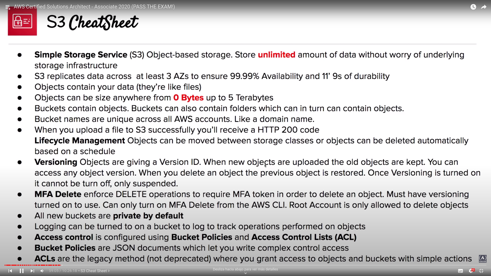
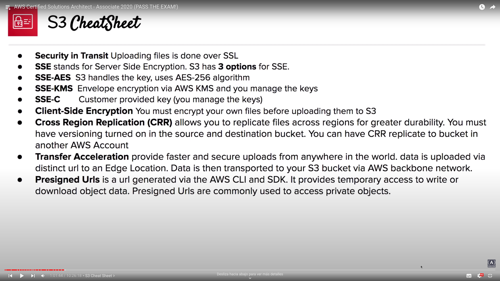
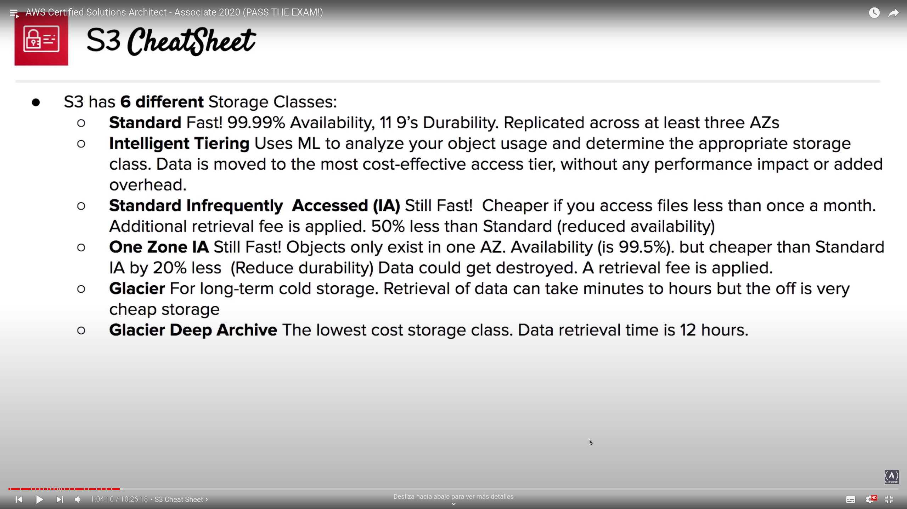

# S3

Simple Storage Service

## Overview
- S3 is in a global region
- Serverles storage in the cloud. Unlimited storage without worry about underlying infrastructure.
- Object-based storage service -> data as objects, not like file systems (data as files in a file hierarchy) or block storages (data as blocks within sectors/tracks)

- S3 console -> interface to manage your data
- S3 object -> container for your data.
	- Key: name of the object
	- Value: the data itself, sequence of bytes
	- Version ID (when versioning is enabled)
	- Metadata -> additional information attached to the object
	- You can store data from 0 bytes to 5 terabytes in size (for bigger files, check multipart)
- S3 Bucket -> Buckets hold objects and can also have folder which in turn hold objects. Universal namespace (name MUST be unique globally)

## Comparision between S3 options
S3 trades retrieval time, accessibility and durability for cheaper storage. From the most expensive to the cheapest:

- Standard (default)
- Intelligent Tiering
- Standard Infrequently Accessed (IA)
- One Zone IA
- Glacier Instant Retrieval
- Glacier Flexible Retrieval
- Glacier Deep Archive
- Reduced redundancy
- S3 on Outposts

Check [S3 Storage Classes Comparison](https://aws.amazon.com/s3/storage-classes/) to comparise the eight S3 services

### S3 guarantees
- S3 is built for 99.99% availability
- Amazon guarantee 99.9% availability
- Amazon guarantees 99.999999999% (11' 9s) of durability

## Security in S3
- Private by default
- Access control is configured using Bucket Policies and ACL (Access Control Lists)
	- ACLs: legacy feature (not deprecated). Simplest way of granting access
	- Bucket policy: JSON documnt policy to define comples rule access
- Requests logs in a different bucket (even in a different AWS account)

## Encryption in S3
- Encryption in transit -> traffic between local host and S3 is secured via SSL/TLS
- Server-Side Encryption (SSE, Encryption at Rest):
	- SSE-AES -> Using AES-256, S3 handkes the key
	- SSE-KMS -> AWS KMS and you manage the keys
	- SSE-C -> Customer provided key, customer manages the keys
- Client-Side Encryption -> customer encrypts files before uploading them to S3
- Files would be accessible, just when files are at rest on the AWS servers, they are going to be encrypted

## Data consistency
- New objects -> Read after Write Consistency: able to read immediately after writing
- Overwrite or delete objects -> Eventual Consistency: it takes time for S3 to replicate versions to AZS, so if you read immediately, S3 may return you an old copy. Just wait a few seconds before reading.

## Cross Region Replication (CRR)
- When enabled any object that is uploadad will be automatically replicated to another region
- Higher durability and potential disaster recovery for objects
- It is required to enable versioning on both the source and destination buckets
- You can also have CRR replicate to another AWS account
- Deletion operation is not copied from one bucket to another

## Versioning
- Store all versions of an object in S3
- Fully integrates with S3 Lifecycle rules
- Once enabled it cannot be disabled, only suspend versioning, but existing versions remains
- MFA Delete -> extra protection against data deletion
- Initial versions with NULL Version ID
- When you upload a new version

## S3 Lifecycle Management
- Automate process of moving objects to different Storage Classes or deleting objects
- Can be used together with versioning -> can be applied to both current an previous versions
- Define filters to group objects and apply the same lifecycle configurations, even using minimum and maximun object size

## Transfer Acceleration
- Fast and secure files transfer over long distances between end users and S3 bucket
- Uses Edge Locations (users-closer data centers)
- Users utilizes a distinct URL for an Edge Location
- Use an optimized network path (Amazon's backbone network)

## Presigned URLS
- Generate temporary URL to provide access to private objects, allows users to both upload and download object data.
- Command to generate presigned URL **MUST** be executed on the same region of the S3 bucket, using AWS CLI: `aws --region <region> s3 presign <s3_url> --expires-in <seconds>`

## MFA Delete
- Ensures users cannot delete objects from a bucket unless they provide their MFA code.
- Conditions to enable it:
	- AWS CLI must be used to turn on MFA
	- Versioning enable

## S3 CLI
- `aws s3`
	- `ls` -> List all buckets
	- `ls <bucket_name>` -> list all folders and objects in bucket
	- `ls <bucket_name>/<folder_name>` -> list all folders and objects in folder
	- `cp <s3_url> <local_folder>` -> downloads object to your local
	- `cp <local_file> <s3_url>` -> uploads object to s3
	- `rm <s3_url_to_object>` -> removes object from s3
	- `presign <s3_url> --expires-in <seconds>` -> generate a presigned url for a s3 bucket that expires in _seconds_

## S3 CheatSheets

