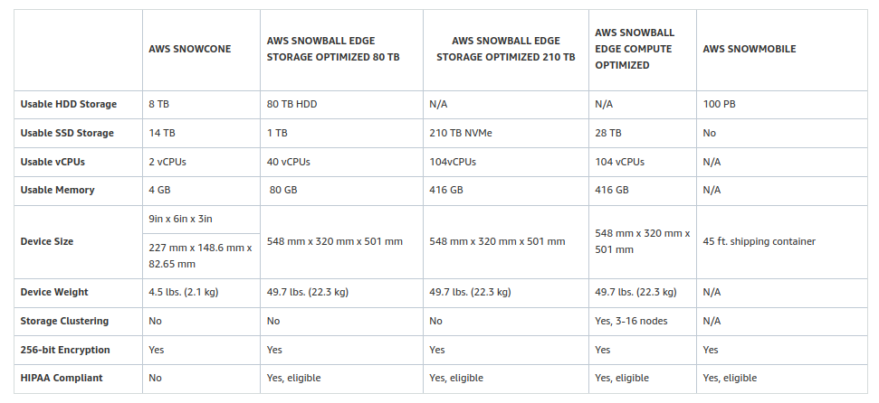
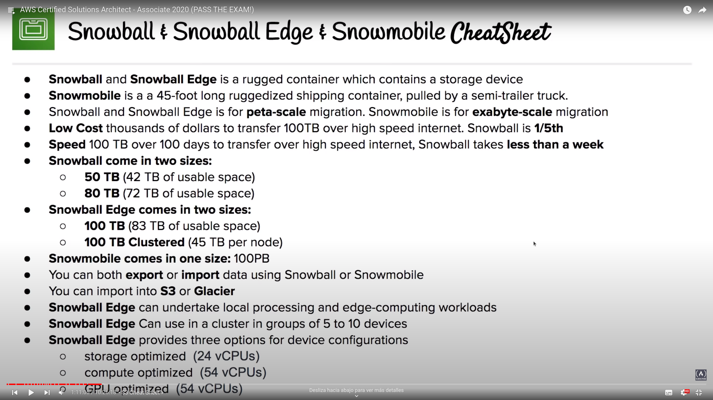

# Snowball

## Overview

- Petabyte-scale data transfer services
- Move data onto AWS via physical briefcase computer
- Low cost, high speed, high data volume transfer (compared to transfer data through internet)

## Features
- Import and Export from S3
- Data is encrypted end-to-end (256-bit keys), uses Trusted Platform Module (TPM)
- Tamper and weather proof -> ruggerized devices
- 3 types:
	- AWS Snowcone
		- HDD (8TB) or SSD (14TB)
		- Portable: smaller and lightweighter than Snowball Edge
		- Offline data migration
		- Online data transfer with AWS DataSync
		- Wired and wireless networking
		- NFS endpoint allows to mount it on instances
		- E2E tracking
		- No HIPAA Compliant
	- AWS Snowball Edge (more storage and with local processing):
		- LCD display
		- Can use in a cluster, 5-10 devices (allows to create a Kubernetes Cluster with EKS Anywhere)
		- Storage, compute or GPU optimiced (^ vCPUs)
		- HIPAA Compliant
	- AWS Snowmobile
		- Shipping container, pulled by a semi-truck
		- Transfer up to 100PB per unit
		- Connect Snowmobile with user network to export data
		- Import data into S3 or directly to Glacier
		- GPS tracking, alarm monitoring, 24/7 video, escort security (optional)
		- HIPAA Compliant

