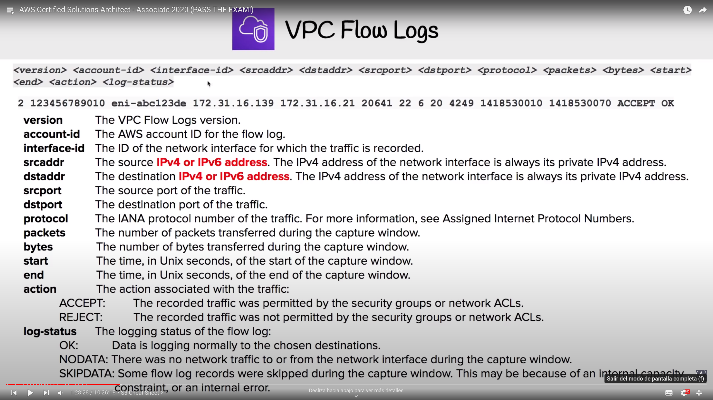

# VPC

Virtual Private Cloud

## Overview
Logically isolated section of the AWS Cloud where you can launch AWS resources in a virtual network defined by you, giving you complete control over your virtual networking environment ("personal data center")

## Key features
- Region specific, 5 VPCs per region maximum
- Each region comes with a default VPC
- 200 subnets by VPC maximum
- VPC allows IPv4 and IPv6 CIDR Blocks (VPC address)
- DNS resolution enabled by default
- DNS hostnames to the instances (disabled by default)
- Default tenancy or dedicated one (dedicated host, more expensive)

### Pricing
- Free:
	- VPCs
	- Route tables
	- NACLs
	- IGWs
	- SGs
	- Subnets
	- VPC Peering
- Costs:
	- NAT Gateways
	- VPC Endpoints
	- VPN Gateway
	- Customer Gateway

## Default VPC
- The goal is allow you to deploy instances immediately.
- IPv4 CIDR block -> 172.31.0.0/16
- /20-sized subnet for each Availability Zone (AZ)
- IGW
- Default SG
- Default NACL
- Default DHCP options set for yout AWS account with your default VPC
- Default route table

## Default Everywhere IP (0.0.0.0/0)
- Represents all possible IP addresses
- In a IGW route table -> allow all internet access
- In a SG inbound rule -> allow all traffic from internet to our resources

## Bastion (deprecated)
- EC2 instance which are security harden
- Used to access resources via SSH or RDP that are in a private subnet
- System Manager's Session Manager replaces the need for Bastions
- [Guacamole Bastion Host](https://aws.amazon.com/marketplace/pp/prodview-hl2sry7k37mgq)

## Direct Connect
- Dedicated network connections from on-premises to AWS
- Very fast network (from 50Mbps to 100Gbps)
- Great for high traffic networks. Reliable and secure

## Flow Logs
- Allow to capture traffic information in-and-out of network interfaces within your VPC
- Created for VPC, subnets and network interfaces
- Log data is stores in CloudWatch Logs, where it can be viewed in detail

### Log Breakdown

## Core components
Combining these components and services is what makes up your VPC

### Internet Gateway (IGW)
- Allows VPCs to access to the internet
- Provides a target in VPC route tables for internet-routable traffic
- Perform NAT for instances that have been assigned public IPv4 addresses
- It is required to add a route to the IGW and set the destination to be the default Everywhere IP (0.0.0.0/0)

### Routing tables
- Used to determine where network traffic is directed
- Each subent in your VPC **MUST** be associated with a route table and **JUST** one
	- But multiple subnets can be associated with one single route table

### Security Groups
- Instance-level virtual firewall that controls inbound and outbound traffic EC2 instances
- All traffic is blocked by default, rules only allow traffic.
- Protocol + Port Range + Source IP + Description (optional)
- Instances can belong to multiple Security Groups and Security Groupds can contain multiple EC2 instances
- Security group rules are permissive.
- Use case: allow a IP range, a specific IP, another security group...
- Stateful: if traffic is allowed inbound it is also allowed outbound
- Changes take effect immediately.
- You cannot block specific IP addresses (see [Network Access Control List (NACLs)](#Network-Access-Control-List-(NACLs))
- Limitations: 
	- Up to 1000 SGs per Region (default is 2500)
	- 60 inbounds and 60 outbound rules per SG
	- 16 SGs per Elastic Network interface (ENI, default is 5)

### Subnets

Private by default (auto-assign public IPv4 address disabled)

#### Public subnet

#### Private subnet

### Virtual Private Gateway (VPN Gateway)

### NAT gateway
- NAT instances 100% managed by AWS
- Re-mapping one IP address space into another
- Use case: Give access to the internet to a Private Network (remap private IPs)
- Redundant instances within the selected AZ
- Automatically assigned with a public address
- Route tables for the NAT Gateway MUST be updated by administrator
- 1 NAT gateway per AZ
- Starts at 5 Gbps and scales up to 45Gbps

#### NAT Instances (legacy)
- Individual EC2 instance on public subnet to give access to the internet (MUST exist in a public subnet)
- MUST disable source and destination network checks
- MUST have a route out of the private subnet to the NAT instance
- NAT instance size determinet how much traffic can handle
- High availability can be achieved using:
	- Autoscaling Groups
	- Multiple subnets in different AZs-
	- Automatic failover
- Community AMIs exist to launch NAT instances
- Should not be used as Bastions

### VPC Endpoints
- Allows you to privately connect VPC with other AWS services
	- Instances in the VPC do not require a public IP address to communicate with service resources
	- Traffic between your VPC and other services does not leave the AWS network
	- Allow reliable and secure communication between services and instances
- Horizontally scalled, redundant and highly available VPC component
- 2 types: Interface Endpoints and Gateway Endpoints

### Interface Endpoints
- Elastic Network Interfaces (ENI) with private IP address
- Uses AWS PowerLink
- Supports multiple services

#### Pricing
- Internet endpoint per AZ (\$/hour): 0.01 -> 24/7 ~7.5$
- 0.01$/GB data processed

### Gateway Endpoints
- Gateway that is a target for a specific route in yout route table.
- It is FREE
- Only support S3 and DynamoDB

### VPC Peering
- Allows you to connect VPC between them over a direct network route using private IP addresses
- Instances on peered VPC behave just like they are on the same network
- Connects VPCS same or differents AWS accounts and/or regions
- Star configuration: 1 central VPC, the rest around the central one
	- No Transitive Peering -> One to One to connect immediate VPC
- No Overlapping CIDR Blocks

### Network Access Control List (NACLs)
- VPCs are automatically given a default NACL which allows all outbound and inbound traffic
- Layer of security, acts like a firewall at subnet level
- Denies all traffic by default
- Stateless: any allowed inbound traffic is also allowed outbound
- Subnets an only belong to a single NACL, but a same NACLs can be associated to multiple subnets
- Seems like Linux iptables, allowing or denying incoming and outcoming subnet traffic
- Rule number -> evaluation order from lowest (0) to highest (32766). AWS recommends to work in 10 or 100 increments to deal with new rules addition.
- Use case: block by IP, additional protection in case Security Groups SSH port wass left open
